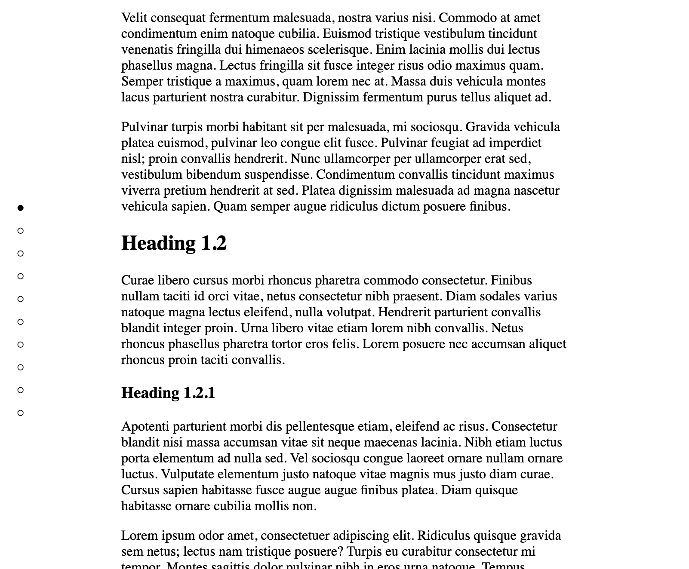
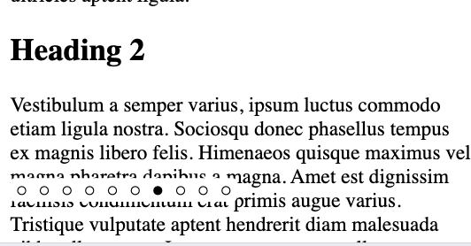

# wc-minimap

A minimap for your article! As a web component!

It has some minimal styling in a Shadow DOM. Includes a verticle mode for screens of >768px and a horizontal mode for all the rest.

# Screenshots

Desktop: 



Mobile view:



# Usage

```html
<!-- Somewhere… -->
<script src="https://unpkg.com/wc-minimap@latest/wc-minimap.js"></script>
<!-- Somewhere else… -->
<wc-minimap
    data-article-selector="article"
    data-linkify="true"
    data-vibrate="true"
    data-active-state="●"
    data-inactive-state="○"
></wc-minimap>
<!-- A third somewhere… -->
<article>
  <h1>The first heading - 1</h1>
  <p>When in the course of [web] events…</p>
  <h2>A subheading to the first heading - 1.1</h2>
  <p>It becomes necessary to create [to create a web component]</p>
</article>
```

# Options

* `data-article-selector` (required): the selector that contains the article with headings in it.
* `data-linkify` (type: `"true" | "false"`) (default: `true`): if true, the web component will create `id` for each heading lacks one, making the minimap "ticks" clickable.
* `data-vibrate` (type: `"true" | "false"`) (default: `true`): if true, uses the [Vibration API](https://www.w3.org/TR/vibration/) to "click" the device when a header is scrolled past. The idea was to recreate the iPod click wheel.
* `data-active-state` (type: `string`) (default: `"●"`): which character (or characters) will represent the "active" heading.
* `data-inactive-state` (type: `string`) (default: `"○"`): which character (or characters) will represent "inactive" headings.
